# [📈 Live Status](https://demo.upptime.js.org): <!--live status--> **🟧 Partial outage**

This repository contains the open-source uptime monitor and status page for [Upptime](https://upptime.js.org), powered by [Upptime](https://github.com/upptime/upptime).

With [Upptime](https://upptime.js.org), you can get your own unlimited and free uptime monitor and status page, powered entirely by a GitHub repository. We use [Issues](https://github.com/upptime/upptime/issues) as incident reports, [Actions](https://github.com/vrw-guppy/status.virtualrocketwatching.net/actions) as uptime monitors, and [Pages](https://demo.upptime.js.org) for the status page.

<!--start: status pages-->
<!-- This summary is generated by Upptime (https://github.com/upptime/upptime) -->
<!-- Do not edit this manually, your changes will be overwritten -->
<!-- prettier-ignore -->
| URL | Status | History | Response Time | Uptime |
| --- | ------ | ------- | ------------- | ------ |
|  [VRW Web](https://www.virtualrocketwatching.net) | 🟩 Up | [vrw-web.yml](https://github.com/vrw-guppy/status.virtualrocketwatching.net/commits/HEAD/history/vrw-web.yml) | 

 440ms
     
 | 

<a href="https://status.virtualrocketwatching.net/history/vrw-web">100.00%</a>
    

|  [VRW Misskey](https://misskey.virtualrocketwatching.net) | 🟩 Up | [vrw-misskey.yml](https://github.com/vrw-guppy/status.virtualrocketwatching.net/commits/HEAD/history/vrw-misskey.yml) | 

 3674ms
     
 | 

<a href="https://status.virtualrocketwatching.net/history/vrw-misskey">99.69%</a>
    

|  [VRChat](https://vrchat.com/) | 🟩 Up | [vr-chat.yml](https://github.com/vrw-guppy/status.virtualrocketwatching.net/commits/HEAD/history/vr-chat.yml) | 

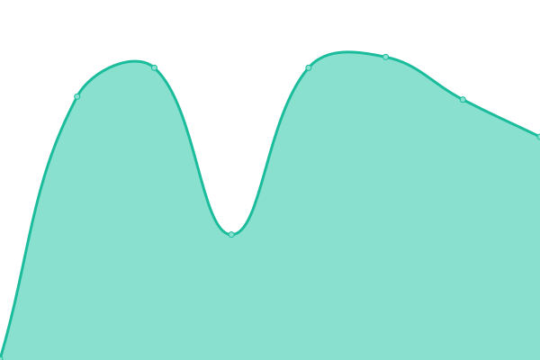 409ms
     
 | 

<a href="https://status.virtualrocketwatching.net/history/vr-chat">100.00%</a>
    

|  [Google](https://www.google.com) | 🟩 Up | [google.yml](https://github.com/vrw-guppy/status.virtualrocketwatching.net/commits/HEAD/history/google.yml) | 

 130ms
     
 | 

<a href="https://status.virtualrocketwatching.net/history/google">100.00%</a>
    

|  [Youtube](https://www.youtube.com) | 🟩 Up | [youtube.yml](https://github.com/vrw-guppy/status.virtualrocketwatching.net/commits/HEAD/history/youtube.yml) | 

 304ms
     
 | 

<a href="https://status.virtualrocketwatching.net/history/youtube">100.00%</a>
    

|  [SpaceX](https://spacex.com) | 🟩 Up | [space-x.yml](https://github.com/vrw-guppy/status.virtualrocketwatching.net/commits/HEAD/history/space-x.yml) | 

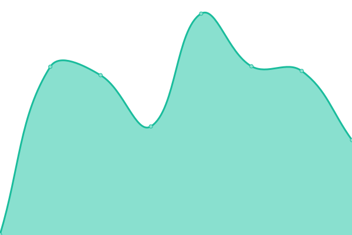 310ms
     
 | 

<a href="https://status.virtualrocketwatching.net/history/space-x">100.00%</a>
    

|  [RocketLab](https://rocketlabcorp.com/) | 🟩 Up | [rocket-lab.yml](https://github.com/vrw-guppy/status.virtualrocketwatching.net/commits/HEAD/history/rocket-lab.yml) | 

 116ms
     
 | 

<a href="https://status.virtualrocketwatching.net/history/rocket-lab">100.00%</a>
    

|  [Blue Origin](https://www.blueorigin.com/) | 🟩 Up | [blue-origin.yml](https://github.com/vrw-guppy/status.virtualrocketwatching.net/commits/HEAD/history/blue-origin.yml) | 

 164ms
     
 | 

<a href="https://status.virtualrocketwatching.net/history/blue-origin">99.59%</a>
    

|  [JAXA](https://www.jaxa.jp/) | 🟩 Up | [jaxa.yml](https://github.com/vrw-guppy/status.virtualrocketwatching.net/commits/HEAD/history/jaxa.yml) | 

 350ms
     
 | 

<a href="https://status.virtualrocketwatching.net/history/jaxa">100.00%</a>
    

|  [NASA](https://www.nasa.gov/) | 🟩 Up | [nasa.yml](https://github.com/vrw-guppy/status.virtualrocketwatching.net/commits/HEAD/history/nasa.yml) | 

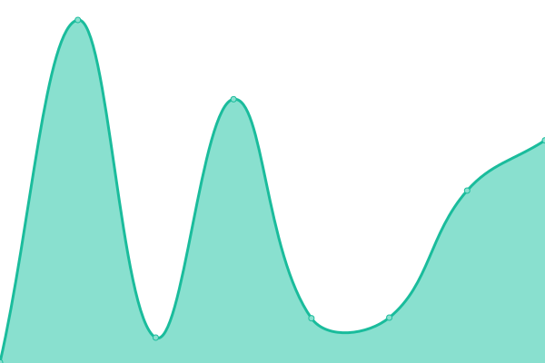 708ms
     
 | 

<a href="https://status.virtualrocketwatching.net/history/nasa">100.00%</a>
    

|  [ESA](https://www.esa.int/) | 🟩 Up | [esa.yml](https://github.com/vrw-guppy/status.virtualrocketwatching.net/commits/HEAD/history/esa.yml) | 

 655ms
     
 | 

<a href="https://status.virtualrocketwatching.net/history/esa">99.84%</a>
    

|  [FAA](https://www.faa.gov/) | 🟩 Up | [faa.yml](https://github.com/vrw-guppy/status.virtualrocketwatching.net/commits/HEAD/history/faa.yml) | 

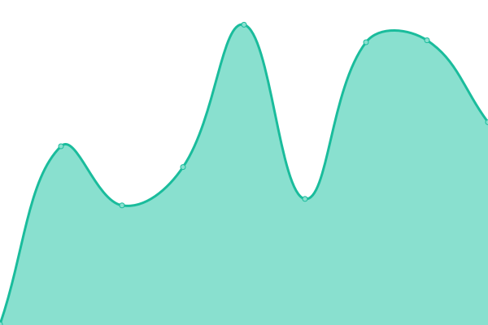 234ms
     
 | 

<a href="https://status.virtualrocketwatching.net/history/faa">100.00%</a>
    

|  [NVS](https://nvs-live.com/) | 🟩 Up | [nvs.yml](https://github.com/vrw-guppy/status.virtualrocketwatching.net/commits/HEAD/history/nvs.yml) | 

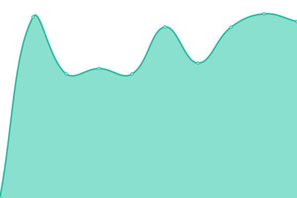 643ms
     
 | 

<a href="https://status.virtualrocketwatching.net/history/nvs">100.00%</a>
    

|  [Gunter](https://space.skyrocket.de/) | 🟩 Up | [gunter.yml](https://github.com/vrw-guppy/status.virtualrocketwatching.net/commits/HEAD/history/gunter.yml) | 

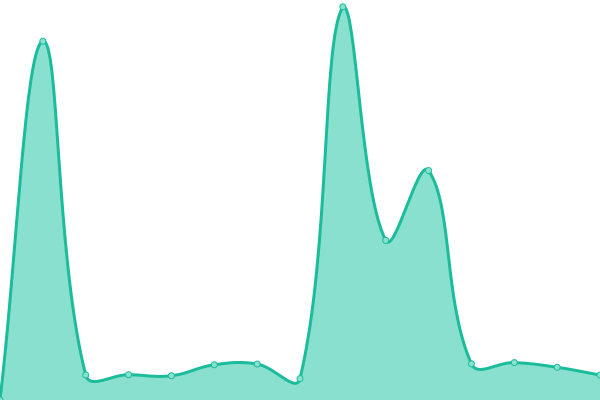 844ms
     
 | 

<a href="https://status.virtualrocketwatching.net/history/gunter">99.82%</a>
    

|  [CelesTrak](https://celestrak.org/) | 🟥 Down | [celes-trak.yml](https://github.com/vrw-guppy/status.virtualrocketwatching.net/commits/HEAD/history/celes-trak.yml) | 

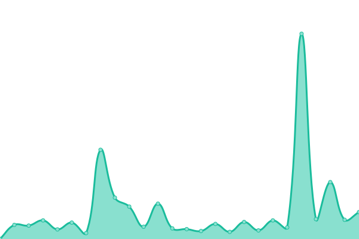 908ms
     
 | 

<a href="https://status.virtualrocketwatching.net/history/celes-trak">99.45%</a>
    

|  [The Space Devs](https://thespacedevs.com/) | 🟩 Up | [the-space-devs.yml](https://github.com/vrw-guppy/status.virtualrocketwatching.net/commits/HEAD/history/the-space-devs.yml) | 

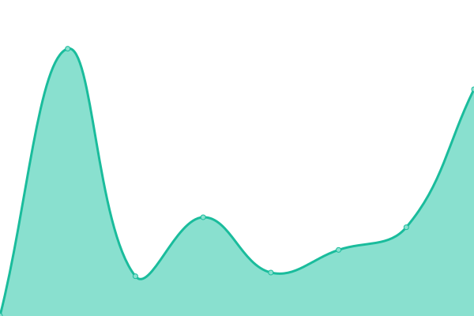 2082ms
     
 | 

<a href="https://status.virtualrocketwatching.net/history/the-space-devs">100.00%</a>
    

|  [Next Spaceflight](https://nextspaceflight.com/) | 🟩 Up | [next-spaceflight.yml](https://github.com/vrw-guppy/status.virtualrocketwatching.net/commits/HEAD/history/next-spaceflight.yml) | 

 195ms
     
 | 

<a href="https://status.virtualrocketwatching.net/history/next-spaceflight">100.00%</a>
    

|  [Spaceflight Now](https://spaceflightnow.com/) | 🟩 Up | [spaceflight-now.yml](https://github.com/vrw-guppy/status.virtualrocketwatching.net/commits/HEAD/history/spaceflight-now.yml) | 

 158ms
     
 | 

<a href="https://status.virtualrocketwatching.net/history/spaceflight-now">100.00%</a>
    

|  [NASA Spaceflight](https://www.nasaspaceflight.com/) | 🟩 Up | [nasa-spaceflight.yml](https://github.com/vrw-guppy/status.virtualrocketwatching.net/commits/HEAD/history/nasa-spaceflight.yml) | 

 98ms
     
 | 

<a href="https://status.virtualrocketwatching.net/history/nasa-spaceflight">100.00%</a>
    

|  [Space News](https://spacenews.com/) | 🟩 Up | [space-news.yml](https://github.com/vrw-guppy/status.virtualrocketwatching.net/commits/HEAD/history/space-news.yml) | 

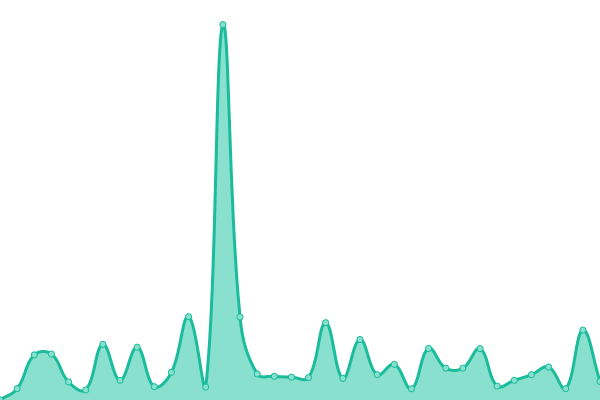 160ms
     
 | 

<a href="https://status.virtualrocketwatching.net/history/space-news">100.00%</a>
    

|  [Space.com](https://www.space.com/) | 🟩 Up | [space-com.yml](https://github.com/vrw-guppy/status.virtualrocketwatching.net/commits/HEAD/history/space-com.yml) | 

 208ms
     
 | 

<a href="https://status.virtualrocketwatching.net/history/space-com">100.00%</a>
    

|  [Nikkei News](https://www.nikkei.com/) | 🟩 Up | [nikkei-news.yml](https://github.com/vrw-guppy/status.virtualrocketwatching.net/commits/HEAD/history/nikkei-news.yml) | 

 1326ms
     
 | 

<a href="https://status.virtualrocketwatching.net/history/nikkei-news">100.00%</a>
    

|  [Sorae](https://sorae.info/) | 🟩 Up | [sorae.yml](https://github.com/vrw-guppy/status.virtualrocketwatching.net/commits/HEAD/history/sorae.yml) | 

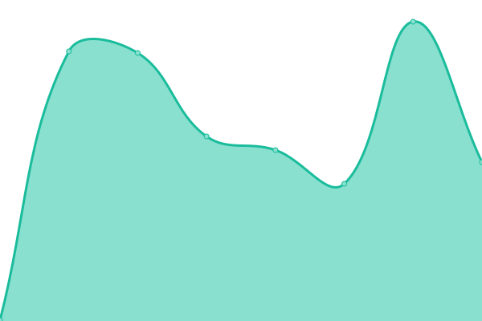 321ms
     
 | 

<a href="https://status.virtualrocketwatching.net/history/sorae">100.00%</a>
    

|  [UchuBiz](https://uchubiz.com/) | 🟩 Up | [uchu-biz.yml](https://github.com/vrw-guppy/status.virtualrocketwatching.net/commits/HEAD/history/uchu-biz.yml) | 

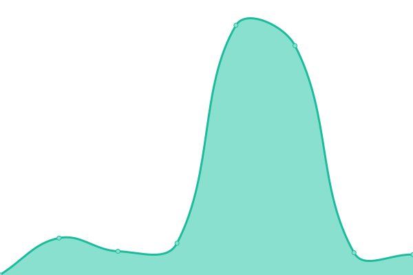 300ms
     
 | 

<a href="https://status.virtualrocketwatching.net/history/uchu-biz">100.00%</a>
    

|  [ClearUsui](https://clearusui.com/) | 🟩 Up | [clear-usui.yml](https://github.com/vrw-guppy/status.virtualrocketwatching.net/commits/HEAD/history/clear-usui.yml) | 

 174ms
     
 | 

<a href="https://status.virtualrocketwatching.net/history/clear-usui">100.00%</a>
    

|  [AbeHiroshi](https://abehiroshi.la.coocan.jp/) | 🟩 Up | [abe-hiroshi.yml](https://github.com/vrw-guppy/status.virtualrocketwatching.net/commits/HEAD/history/abe-hiroshi.yml) | 

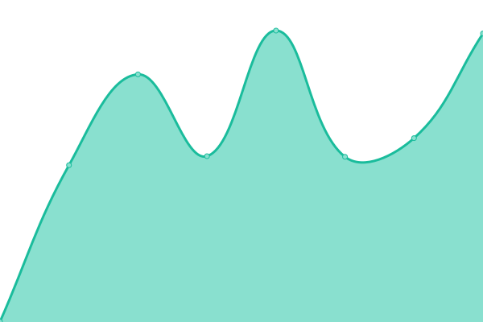 732ms
     
 | 

<a href="https://status.virtualrocketwatching.net/history/abe-hiroshi">100.00%</a>
    

|  [RussianSpaceWeb](https://www.russianspaceweb.com/) | 🟩 Up | [russian-space-web.yml](https://github.com/vrw-guppy/status.virtualrocketwatching.net/commits/HEAD/history/russian-space-web.yml) | 

 902ms
     
 | 

<a href="https://status.virtualrocketwatching.net/history/russian-space-web">100.00%</a>
    

|  [X](https://x.com) | 🟩 Up | [x.yml](https://github.com/vrw-guppy/status.virtualrocketwatching.net/commits/HEAD/history/x.yml) | 

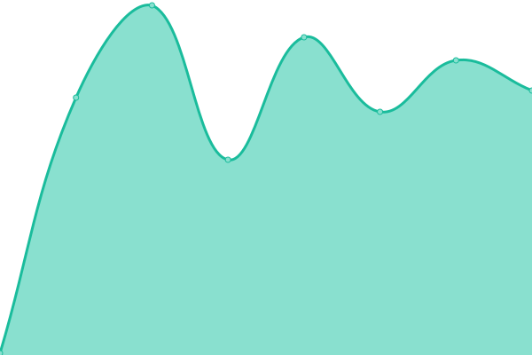 2331ms
     
 | 

<a href="https://status.virtualrocketwatching.net/history/x">99.70%</a>
    

|  [Misskey](https://misskey.io) | 🟩 Up | [misskey.yml](https://github.com/vrw-guppy/status.virtualrocketwatching.net/commits/HEAD/history/misskey.yml) | 

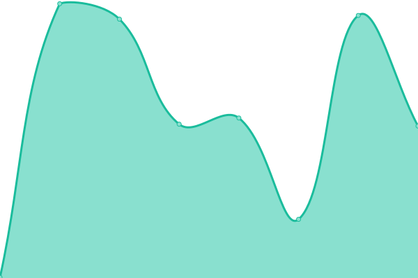 419ms
     
 | 

<a href="https://status.virtualrocketwatching.net/history/misskey">100.00%</a>
    

|  [Booth](https://booth.pm/) | 🟩 Up | [booth.yml](https://github.com/vrw-guppy/status.virtualrocketwatching.net/commits/HEAD/history/booth.yml) | 

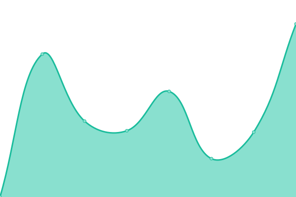 1547ms
     
 | 

<a href="https://status.virtualrocketwatching.net/history/booth">100.00%</a>
    

|  [WeChat](https://mp.weixin.qq.com) | 🟩 Up | [we-chat.yml](https://github.com/vrw-guppy/status.virtualrocketwatching.net/commits/HEAD/history/we-chat.yml) | 

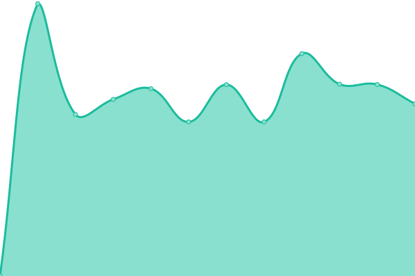 1311ms
     
 | 

<a href="https://status.virtualrocketwatching.net/history/we-chat">99.81%</a>
    

|  [Weibo](https://weibo.com/) | 🟩 Up | [weibo.yml](https://github.com/vrw-guppy/status.virtualrocketwatching.net/commits/HEAD/history/weibo.yml) | 

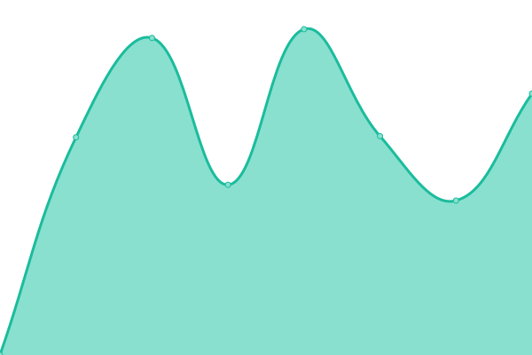 3042ms
     
 | 

<a href="https://status.virtualrocketwatching.net/history/weibo">100.00%</a>
    

|  [Telegram](https://telegram.org/) | 🟩 Up | [telegram.yml](https://github.com/vrw-guppy/status.virtualrocketwatching.net/commits/HEAD/history/telegram.yml) | 

 536ms
     
 | 

<a href="https://status.virtualrocketwatching.net/history/telegram">99.82%</a>
    

|  [ChatGPT](https://www.chatgpt.com) | 🟩 Up | [chat-gpt.yml](https://github.com/vrw-guppy/status.virtualrocketwatching.net/commits/HEAD/history/chat-gpt.yml) | 

 111ms
     
 | 

<a href="https://status.virtualrocketwatching.net/history/chat-gpt">100.00%</a>
    

|  [Gemini](https://gemini.google.com) | 🟩 Up | [gemini.yml](https://github.com/vrw-guppy/status.virtualrocketwatching.net/commits/HEAD/history/gemini.yml) | 

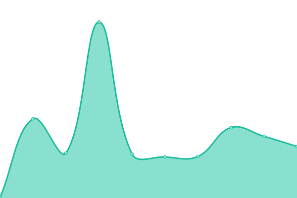 555ms
     
 | 

<a href="https://status.virtualrocketwatching.net/history/gemini">100.00%</a>
    

|  [Claude](https://claude.ai) | 🟩 Up | [claude.yml](https://github.com/vrw-guppy/status.virtualrocketwatching.net/commits/HEAD/history/claude.yml) | 

 111ms
     
 | 

<a href="https://status.virtualrocketwatching.net/history/claude">100.00%</a>
    

|  [GitHub](https://github.com) | 🟩 Up | [git-hub.yml](https://github.com/vrw-guppy/status.virtualrocketwatching.net/commits/HEAD/history/git-hub.yml) | 

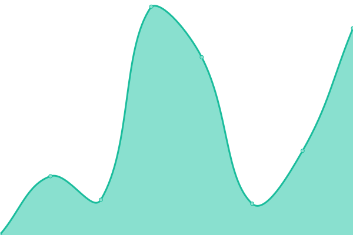 162ms
     
 | 

<a href="https://status.virtualrocketwatching.net/history/git-hub">100.00%</a>
    

|  [Google DNS 1](8.8.4.4) | 🟩 Up | [google-dns-1.yml](https://github.com/vrw-guppy/status.virtualrocketwatching.net/commits/HEAD/history/google-dns-1.yml) | 

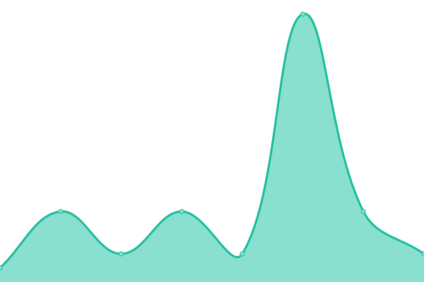 3ms
     
 | 

<a href="https://status.virtualrocketwatching.net/history/google-dns-1">100.00%</a>
    

|  [Google DNS 2](8.8.8.8) | 🟩 Up | [google-dns-2.yml](https://github.com/vrw-guppy/status.virtualrocketwatching.net/commits/HEAD/history/google-dns-2.yml) | 

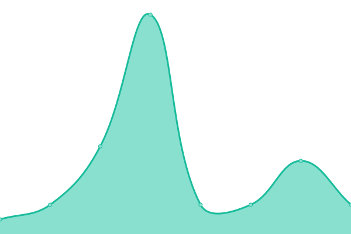 4ms
     
 | 

<a href="https://status.virtualrocketwatching.net/history/google-dns-2">100.00%</a>
    

|  [Cloudflare DNS 1](1.1.1.1) | 🟩 Up | [cloudflare-dns-1.yml](https://github.com/vrw-guppy/status.virtualrocketwatching.net/commits/HEAD/history/cloudflare-dns-1.yml) | 

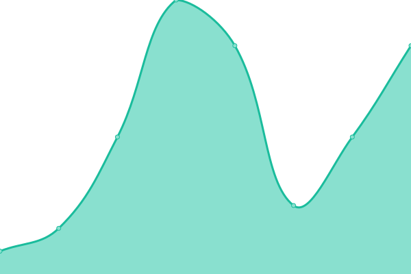 3ms
     
 | 

<a href="https://status.virtualrocketwatching.net/history/cloudflare-dns-1">100.00%</a>
    

|  [Cloudflare DNS 2](1.0.0.1) | 🟩 Up | [cloudflare-dns-2.yml](https://github.com/vrw-guppy/status.virtualrocketwatching.net/commits/HEAD/history/cloudflare-dns-2.yml) | 

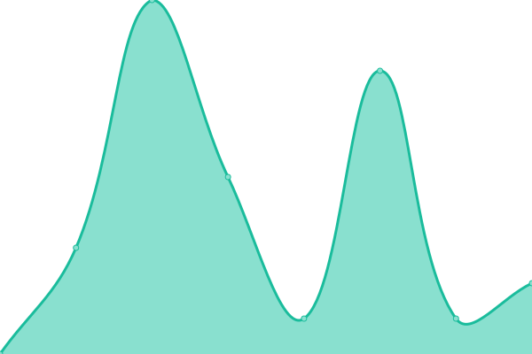 3ms
     
 | 

<a href="https://status.virtualrocketwatching.net/history/cloudflare-dns-2">100.00%</a>
    

<!--end: status pages-->

[**Visit our status website →**](https://demo.upptime.js.org)

## 📄 License

- Powered by: [Upptime](https://github.com/upptime/upptime)
- Code: [MIT](./LICENSE) © [Anand Chowdhary](https://anandchowdhary.com), supported by [Pabio](https://pabio.com)
- Data in the `./history` directory: [Open Database License](https://opendatacommons.org/licenses/odbl/1-0/)
